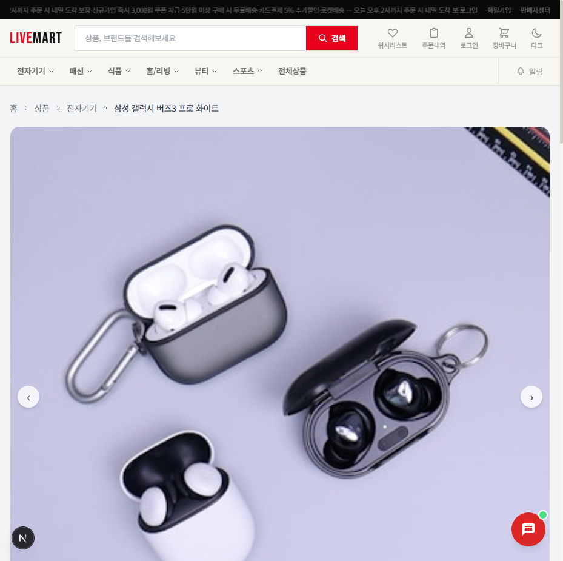
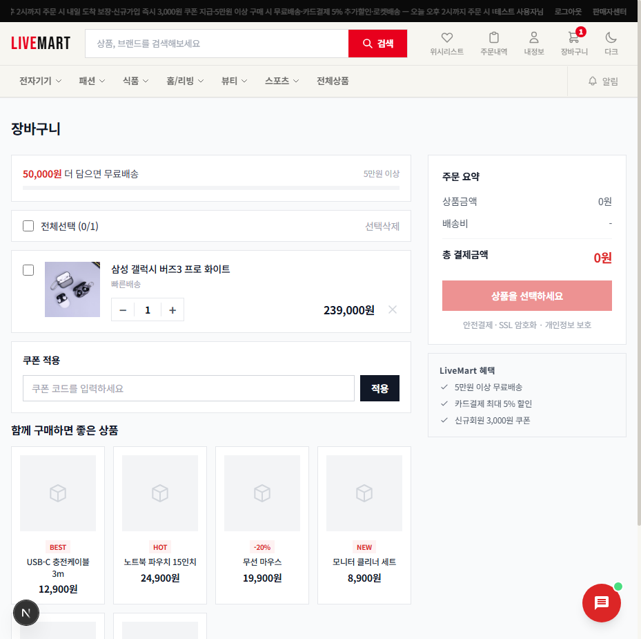

# LiveMart — MSA 기반 이커머스 플랫폼

[](https://github.com/parkmin-je/livemart-msa-ecommerce/actions/workflows/ci.yml)
[](https://openjdk.org/)
[](https://spring.io/projects/spring-boot)
[](https://kubernetes.io/)
[](LICENSE)

Java 21 + Spring Boot 3.4로 구현한 MSA 이커머스 플랫폼입니다.
실무에서 자주 쓰이는 분산 시스템 패턴(Saga, Outbox, CQRS, Event Sourcing)을 직접 구현하며 학습한 포트폴리오 프로젝트입니다.

---

## 시스템 아키텍처

```
Client (Next.js 15)
    │
    ▼
API Gateway (Spring Cloud Gateway)
├── JWT 인증 · Rate Limiting (Redis Token Bucket) · Circuit Breaker
├── Eureka Service Discovery
│
├── user-service      :8085  — 회원가입/로그인, JWT, OAuth2, MFA
├── product-service   :8082  — 상품 CRUD, Elasticsearch 검색, gRPC 서버
├── order-service     :8083  — 주문, Saga, 쿠폰, 반품, Event Sourcing
├── payment-service   :8084  — 결제, 환불, Kafka DLQ
├── inventory-service :8088  — 재고 관리
├── analytics-service :8087  — 매출 분석, A/B 테스트
├── notification-svc  :8086  — 알림 (Kafka + Redis Pub/Sub SSE)
├── ai-service        :8090  — Spring AI 1.0 (OpenRouter)
└── eureka-server     :8761
```

---

## 핵심 구현

### 1. Kafka Saga + Transactional Outbox

주문→결제→재고 분산 트랜잭션을 **Saga Choreography**로 구현했습니다.
주문 저장과 이벤트 발행을 단일 DB 트랜잭션으로 처리해 메시지 유실을 방지합니다.

```java
// OutboxProcessor.java
// 주문 저장 + Outbox 이벤트를 같은 트랜잭션에 저장 → 별도 스레드에서 Kafka 발행
kafkaTemplate.send(topic, key, payload).get(5, TimeUnit.SECONDS);
outboxEvent.setStatus(OutboxStatus.PUBLISHED);
```

실패 시 ExponentialBackOff(1s→2s→4s, 3회 재시도) → Dead Letter Topic(*.DLT)으로 이동합니다.

### 2. gRPC 서비스 간 통신

order-service → product-service 상품 조회를 gRPC(HTTP/2 + Protobuf)로 구현했습니다.

```proto
// product.proto
service ProductGrpcService {
  rpc GetProductsByIds(GetProductsByIdsRequest) returns (stream ProductResponse);
  rpc DeductStock(DeductStockRequest) returns (DeductStockResponse);
}
```

### 3. Redis Pub/Sub 분산 실시간 알림

수평 확장 환경에서 여러 포드 간 SSE 이벤트를 Redis Pub/Sub으로 브로드캐스팅합니다.

```java
// 재고 변경 이벤트 발행
redisTemplate.convertAndSend("product:stock-updates", payload);

// 구독 후 SSE emitter에 전달
public void onMessage(Message message, byte[] pattern) {
    sseEmitters.forEach(emitter -> emitter.send(SseEmitter.event().data(message.toString())));
}
```

### 4. Kafka DLQ + 병렬 소비

```java
// 장애 격리: 3회 재시도 후 DLT 이동
DeadLetterPublishingRecoverer recoverer = new DeadLetterPublishingRecoverer(kafkaTemplate,
    (record, ex) -> new TopicPartition(record.topic() + ".DLT", -1));

// 병렬 소비 + Java 21 Virtual Threads
factory.setConcurrency(3);
factory.getContainerProperties().setListenerTaskExecutor(
    Executors.newVirtualThreadPerTaskExecutor());
```

### 5. AOP 기반 Prometheus 비즈니스 메트릭

```java
// OrderMetricsAspect.java
@Around("execution(* com.livemart.order.service.OrderService.createOrder(..))")
public Object measure(ProceedingJoinPoint pjp) throws Throwable {
    // orders.created.total, orders.processing.seconds 메트릭 수집
}
```

### 6. Spring AI 1.0 연동

OpenRouter를 통해 LLM을 연동하고 상품 설명 생성, 검색 개선 등에 활용합니다.

```java
// AiService.java
public String generateProductDescription(ProductDescriptionRequest req) {
    return chatClient.prompt()
        .user(buildPrompt(req))
        .call()
        .content();
}
```

---

## 기술 스택

### 백엔드

| 분류 | 기술 |
|------|------|
| Language | Java 21 · Virtual Threads (Project Loom) |
| Framework | Spring Boot 3.4.1 · Spring Cloud 2024.0.0 |
| API | REST · gRPC · WebSocket · SSE |
| 메시징 | Apache Kafka + DLQ · 병렬 소비 |
| 실시간 | Redis Pub/Sub (분산 SSE 브로드캐스팅) |
| 캐싱 | Redis (Cache-Aside · Rate Limiting) |
| 검색 | Elasticsearch 8 (nori 형태소 분석기) |
| 인증 | JWT httpOnly Cookie · OAuth2 (Google/Kakao/Naver) · MFA (TOTP) |
| 결제 | Stripe (Idempotency Key 기반 중복 방지) |
| AI | Spring AI 1.0 · OpenRouter |
| 분산 락 | Redisson |
| Circuit Breaker | Resilience4j |

### 프론트엔드

| 분류 | 기술 |
|------|------|
| Framework | Next.js 15 · React 19 |
| 상태 관리 | Zustand · TanStack Query |
| 스타일 | Tailwind CSS |

### 테스트

| 분류 | 기술 |
|------|------|
| 단위 테스트 | JUnit 5 · Mockito |
| 통합 테스트 | Testcontainers (PostgreSQL · Kafka) |
| 아키텍처 테스트 | ArchUnit (레이어 의존성 검증) |
| 계약 테스트 | Spring Cloud Contract (order↔payment) |
| 부하 테스트 | k6 (order-flow 시나리오) |
| 커버리지 | JaCoCo |

### 인프라

| 분류 | 기술 |
|------|------|
| 컨테이너 | Docker · Kubernetes (HPA) |
| CI/CD | GitHub Actions → Docker → GHCR → K8s |
| GitOps | ArgoCD |
| IaC | Terraform (AWS VPC, EKS, RDS, ElastiCache) |
| 모니터링 | Prometheus + Grafana |
| 분산 추적 | OpenTelemetry → Zipkin |
| 패키지 | Helm Charts |

---

## 서비스 구성

```
├── api-gateway/          Spring Cloud Gateway · Rate Limiting · JWT 검증
├── user-service/         회원 · JWT · OAuth2 · MFA(TOTP) · 위시리스트
├── product-service/      상품 · Elasticsearch · gRPC 서버 · Redis 캐싱 · S3
├── order-service/        주문 · Saga · Outbox · 쿠폰 · 반품 · Event Sourcing
├── payment-service/      Stripe 결제 · 환불 · Kafka DLQ
├── analytics-service/    매출 분석 · A/B 테스트
├── ai-service/           Spring AI 1.0 · OpenRouter
├── inventory-service/    재고 관리
├── notification-service/ 이메일/알림 · Redis Pub/Sub SSE
├── eureka-server/        서비스 레지스트리
└── common/               Outbox · Event Sourcing · 분산 락 · 멱등성 · RFC 7807 에러
```

---

## 실행 방법

### 사전 요구사항

- Java 21+
- Docker Desktop
- Node.js 20+

### 1. 환경 변수 설정

```bash
cp .env.example .env
# .env 파일에서 JWT_SECRET, DB 비밀번호, OAuth2 키 등 입력
```

### 2. 인프라 기동

```bash
docker-compose up -d
```

### 3. 서비스 기동 (순서 중요)

```bash
# 1. Eureka
./gradlew :eureka-server:bootRun &

# 2. API Gateway
./gradlew :api-gateway:bootRun &

# 3. 비즈니스 서비스
./gradlew :user-service:bootRun -Dspring.profiles.active=local &
./gradlew :product-service:bootRun -Dspring.profiles.active=local &
./gradlew :order-service:bootRun -Dspring.profiles.active=local &
./gradlew :payment-service:bootRun -Dspring.profiles.active=local &

# 4. 프론트엔드
cd frontend && npm install && npm run dev
```

### 포트 맵

| 서비스 | 포트 |
|--------|------|
| Next.js Frontend | 3000 |
| API Gateway | 8080 |
| Eureka Dashboard | 8761 |
| user-service | 8085 |
| product-service | 8082 |
| order-service | 8083 |
| payment-service | 8084 |
| inventory-service | 8088 |
| Grafana | 3001 |
| Prometheus | 9090 |
| Zipkin | 9411 |

### 테스트 실행

```bash
./gradlew :order-service:test :order-service:jacocoTestReport
./gradlew :payment-service:contractTest
k6 run tests/load/k6-order-flow.js
```

---

## Architecture Decision Records

| ADR | 주제 | 결정 |
|-----|------|------|
| [ADR-001](docs/adr/ADR-001-saga-pattern.md) | 분산 트랜잭션 | Saga Choreography |
| [ADR-002](docs/adr/ADR-002-outbox-pattern.md) | 이벤트 신뢰성 | Transactional Outbox |
| [ADR-003](docs/adr/ADR-003-grpc-product-query.md) | 서비스 간 통신 | gRPC |
| [ADR-004](docs/adr/ADR-004-redis-caching-strategy.md) | 캐싱 전략 | Cache-Aside |
| [ADR-005](docs/adr/ADR-005-elasticsearch-search.md) | 검색 엔진 | Elasticsearch (nori) |

---

## 스크린샷

<details>
<summary>화면 보기 (16장)</summary>

| 홈페이지 | 상품 목록 |
|--------|---------|
|  |  |

| 상품 상세 | 장바구니 |
|--------|---------|
|  |  |

| 관리자 대시보드 | 판매자 페이지 |
|--------|---------|
|  |  |

</details>

---

## 개발 환경

- **OS**: Windows 11
- **IDE**: IntelliJ IDEA
- **JDK**: OpenJDK 21
- **Build**: Gradle 8.5
