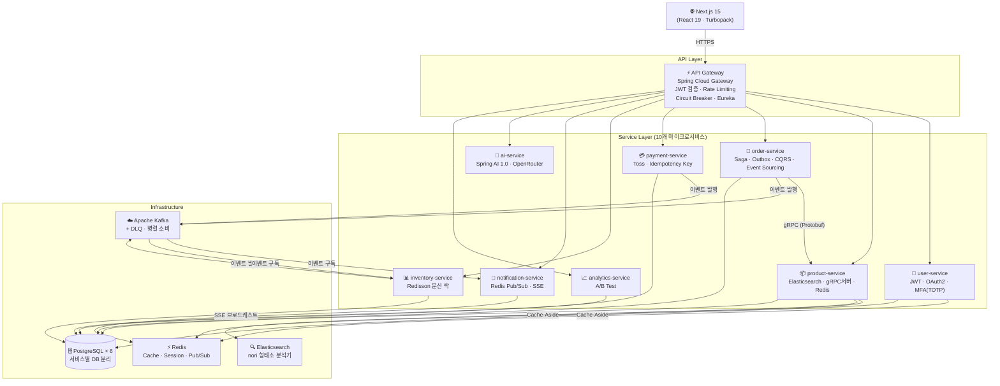
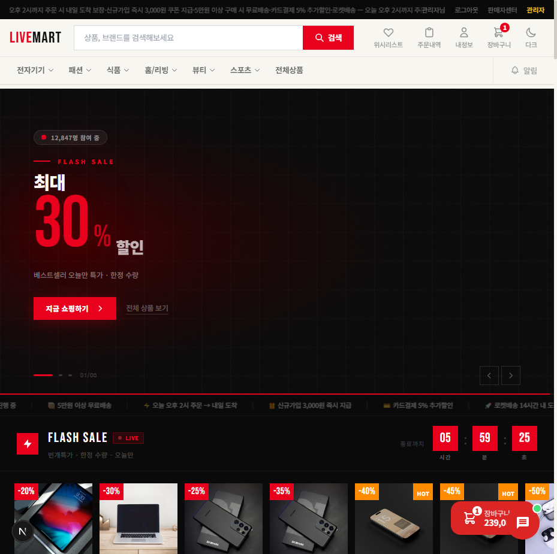
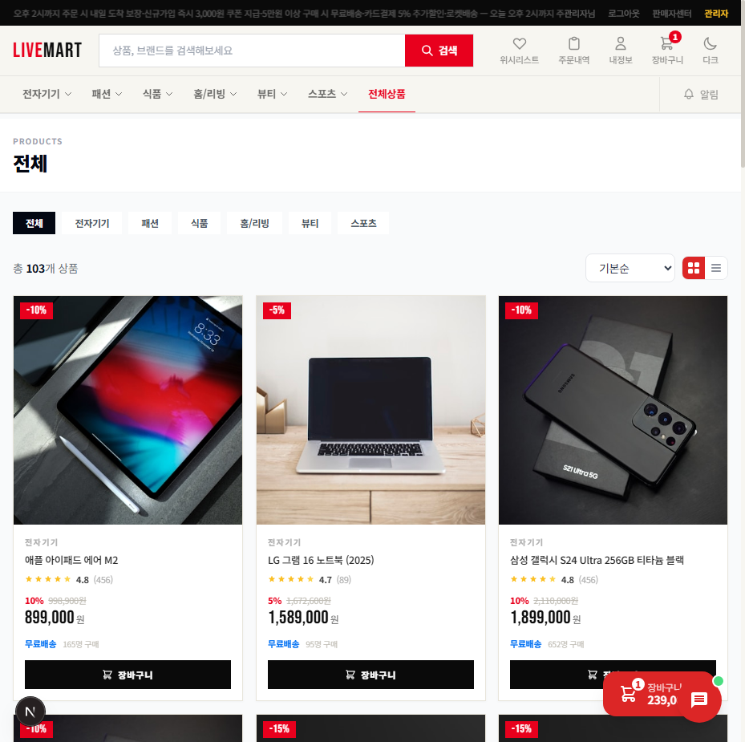
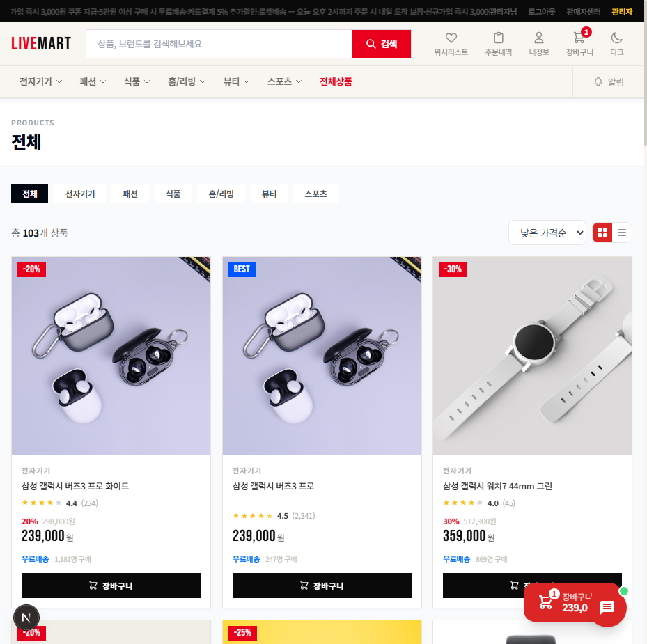
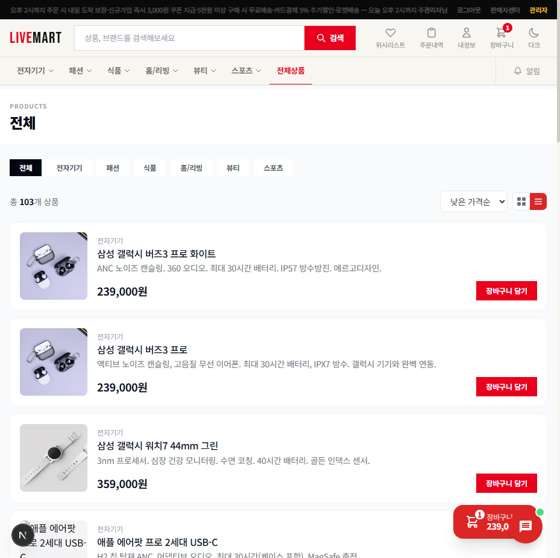
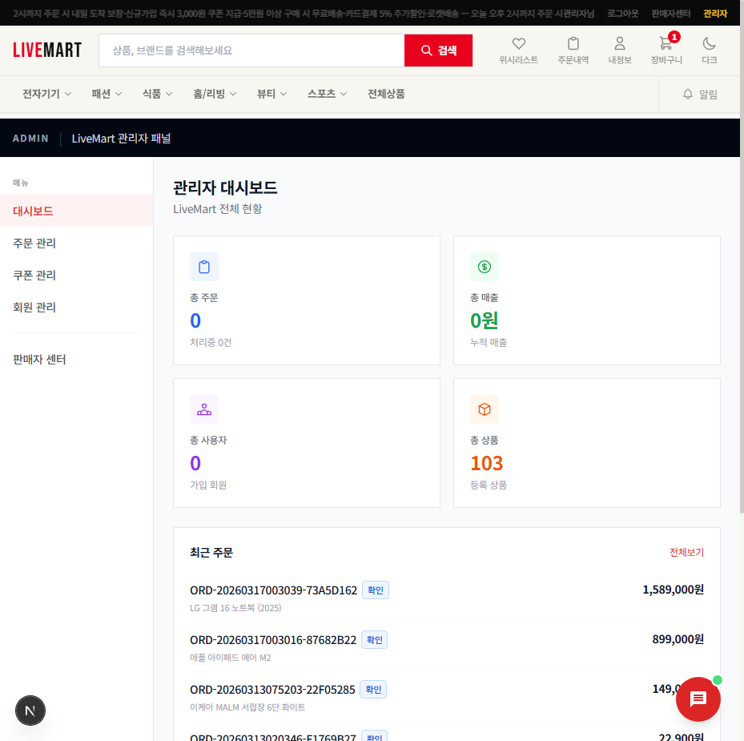
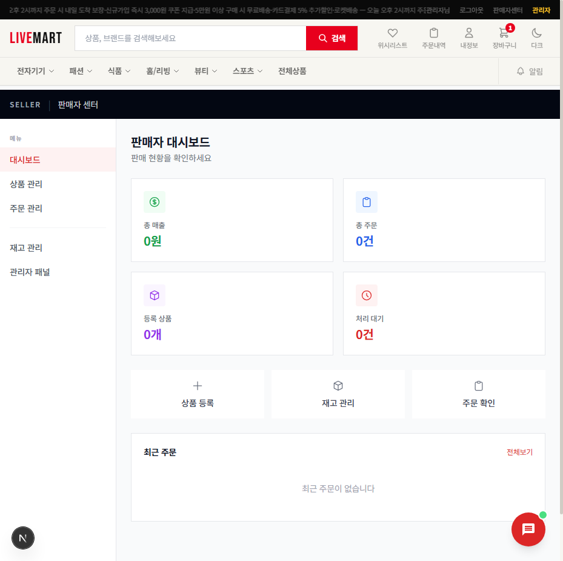

# LiveMart — MSA 이커머스 플랫폼

[](https://github.com/parkmin-je/livemart-msa-ecommerce/actions/workflows/ci.yml)
[](https://openjdk.org/)
[](https://spring.io/projects/spring-boot)
[](https://nextjs.org/)
[](https://kubernetes.io/)
[](LICENSE)

> Java 21 + Spring Boot 3.4 + Next.js 15로 구현한 MSA 이커머스 포트폴리오 프로젝트.
> Saga, Outbox, CQRS, Event Sourcing 등 분산 시스템 패턴을 직접 구현했습니다.

---

## 🔗 라이브 데모 & 기술 블로그

| | 링크 |
|---|---|
| **🌐 프론트엔드 데모** | [livemart.vercel.app](https://livemart.vercel.app) *(Vercel 배포 예정)* |
| **📖 블로그 — Saga+Outbox 구현기** | [docs/blog/01-saga-outbox-패턴-실전-구현기.md](docs/blog/01-saga-outbox-패턴-실전-구현기.md) |
| **📖 블로그 — 결제 취약점 발견·수정** | [docs/blog/02-결제-취약점-발견-수정기.md](docs/blog/02-결제-취약점-발견-수정기.md) |
| **📖 블로그 — 분산 SSE 구현기** | [docs/blog/03-redis-pubsub-분산-SSE-구현기.md](docs/blog/03-redis-pubsub-분산-SSE-구현기.md) |
| **🚀 배포 가이드** | [DEPLOY.md](DEPLOY.md) |

---

## 시스템 아키텍처



---

## 핵심 구현 — "왜 이 기술을 선택했는가"

### 1. Kafka Saga + Transactional Outbox

주문→결제→재고 3단계 분산 트랜잭션을 **Saga Choreography**로 구현했습니다. 2PC를 먼저 검토했지만 서비스 간 강결합과 데드락 문제로 포기했습니다.

핵심 문제: Kafka `send()`가 DB 커밋 후 실패하면 이벤트가 유실됩니다. 이를 **Transactional Outbox 패턴**으로 해결했습니다. 주문 저장과 Outbox 이벤트 삽입을 **같은 트랜잭션**에서 처리하고, 별도 스레드가 Kafka에 발행합니다.

```java
// OutboxProcessor.java — 주문 저장과 이벤트를 단일 트랜잭션으로
@Transactional
public Order createOrder(OrderRequest req) {
    Order order = orderRepository.save(buildOrder(req));
    outboxRepository.save(OutboxEvent.of("order.created", order)); // 같은 TX
    return order;
}

// 별도 스케줄러에서 Outbox → Kafka 발행 (최소 1회 보장)
kafkaTemplate.send(topic, key, payload).get(5, TimeUnit.SECONDS);
outboxEvent.setStatus(OutboxStatus.PUBLISHED);
```

실패 시 ExponentialBackOff(1s→2s→4s, 3회) → Dead Letter Topic(`*.DLT`) 격리. → [상세 구현기](docs/blog/01-saga-outbox-패턴-실전-구현기.md)

---

### 2. gRPC 서비스 간 통신

주문 생성 시 상품 유효성 검증을 REST 대신 **gRPC(HTTP/2 + Protobuf)**로 구현했습니다. 멀티플렉싱 덕분에 여러 상품을 병렬로 검증할 수 있고, 직렬화 오버헤드도 줄었습니다.

```protobuf
// product.proto
service ProductGrpcService {
  rpc GetProductsByIds(GetProductsByIdsRequest) returns (stream ProductResponse);
  rpc DeductStock(DeductStockRequest) returns (DeductStockResponse);
}
```

---

### 3. Redis Pub/Sub 분산 SSE

단일 서버에서 SSE는 간단하지만, **K8s HPA로 스케일아웃하면 포드가 여러 개**라 특정 포드에 연결된 클라이언트만 이벤트를 받는 문제가 생깁니다. **Redis Pub/Sub**으로 모든 포드에 브로드캐스팅해서 해결했습니다.

```java
// 이벤트 발행 (어느 포드에서든)
redisTemplate.convertAndSend("notifications:" + userId, payload);

// 모든 포드의 구독자가 받아서 SSE로 전달
public void onMessage(Message message, byte[] pattern) {
    emitters.getOrDefault(userId, List.of())
            .forEach(emitter -> emitter.send(SseEmitter.event().data(data)));
}
```
→ [상세 구현기](docs/blog/03-redis-pubsub-분산-SSE-구현기.md)

---

### 4. 결제 금액 서버 검증 (CVSS 9.3 → 수정)

초기에 클라이언트가 전달한 금액을 그대로 결제 처리했습니다. Burp Suite로 amount 필드를 1원으로 조작하면 임의 금액 결제가 가능했습니다. **order-service FeignClient로 실제 주문 금액을 서버에서 재조회**하여 수정했습니다.

```java
// PaymentService.java — 클라이언트 금액 무시, 서버에서 재조회
OrderResponse order = orderClient.getOrder(request.getOrderNumber());
if (!order.getTotalAmount().equals(request.getAmount())) {
    throw new PaymentAmountMismatchException(order.getTotalAmount(), request.getAmount());
}
```
→ [취약점 발견·수정 과정](docs/blog/02-결제-취약점-발견-수정기.md)

---

### 5. Java 21 Virtual Threads + Kafka 병렬 소비

```java
// Project Loom Virtual Threads — I/O 블로킹 구간 비용 최소화
factory.getContainerProperties().setListenerTaskExecutor(
    Executors.newVirtualThreadPerTaskExecutor()
);
factory.setConcurrency(3); // 파티션 3개 병렬 소비
```

---

## 기술 스택

### 백엔드

| 분류 | 기술 |
|------|------|
| Language | Java 21 (Virtual Threads / Project Loom) |
| Framework | Spring Boot 3.4.1 · Spring Cloud 2024.0.0 |
| API | REST · gRPC · WebSocket · SSE · GraphQL |
| 메시징 | Apache Kafka (DLQ · 병렬 소비 · Outbox) |
| 캐싱/세션 | Redis (Cache-Aside · Token Bucket · Pub/Sub) |
| 검색 | Elasticsearch 8 (nori 한글 형태소) |
| 인증 | JWT httpOnly · OAuth2 PKCE (Google/Kakao/Naver) · MFA (TOTP · WebAuthn) |
| 결제 | Toss Payments (서버 금액 검증 · Idempotency Key) |
| 분산 락 | Redisson (재고 Race Condition 방지) |
| Circuit Breaker | Resilience4j |
| AI | Spring AI 1.0 · OpenRouter (MiMo-V2-Pro) |
| 쿼리 | QueryDSL · MapStruct |

### 프론트엔드

| 분류 | 기술 |
|------|------|
| Framework | Next.js 15 (App Router · Turbopack) |
| UI | React 19 · Tailwind CSS 4 · 웜크림 디자인 시스템 |
| 상태 관리 | Zustand · TanStack Query v5 |
| 결제 | Toss Payments SDK |
| 보안 헤더 | CSP · HSTS · X-Frame-Options (미들웨어) |
| 타입 | TypeScript 5.7 (strict mode) |

### 테스트

| 분류 | 도구 |
|------|------|
| 단위 테스트 | JUnit 5 · Mockito |
| 통합 테스트 | Testcontainers (PostgreSQL · Kafka) |
| 아키텍처 테스트 | ArchUnit (레이어 의존성 자동 검증) |
| 계약 테스트 | Spring Cloud Contract (order ↔ payment) |
| E2E 테스트 | Playwright (checkout · search · admin) |
| 부하 테스트 | k6 (smoke · load · spike · stress) |
| 커버리지 | JaCoCo (Service 70% · Controller 60%) |

### 인프라

| 분류 | 기술 |
|------|------|
| 컨테이너 | Docker · Kubernetes 1.28 · Istio mTLS STRICT |
| CI/CD | GitHub Actions → GHCR → K8s (ArgoCD GitOps) |
| IaC | Terraform 1.9 (AWS EKS · RDS · ElastiCache · MSK · OpenSearch) |
| 오토스케일링 | HPA (CPU 70% · Memory 80%) |
| 배포 전략 | Blue-Green (무중단 배포) |
| 모니터링 | Prometheus + Grafana |
| 분산 추적 | OpenTelemetry → Zipkin |
| 보안 스캔 | Trivy · Gitleaks · CodeQL · OWASP ZAP |

---

## 보안 — OWASP Top 10 대응

| 취약점 | 대응 |
|--------|------|
| A01 Broken Access Control | Spring Security RBAC · IDOR 소유자 검증 |
| A02 Cryptographic Failures | JWT HS512 · TLS 1.3 · Istio mTLS |
| A03 Injection | JPA 파라미터 바인딩 · ES 인젝션 방어 |
| A07 Auth Failures | OAuth2 PKCE · Redis 토큰 블랙리스트 · MFA |
| A08 Integrity Failures | 결제 금액 서버 검증 · Docker 이미지 서명 |
| A09 Logging & Monitoring | ELK Stack · Grafana 알림 |
| 자동 스캔 | Trivy + Gitleaks (모든 push) · CodeQL (PR) · ZAP (주간) |

---

## 서비스 구성

```
├── api-gateway/           Spring Cloud Gateway · Rate Limiting · JWT 검증
├── eureka-server/         서비스 레지스트리
├── user-service/          회원 · JWT · OAuth2 · MFA(TOTP/WebAuthn) · 위시리스트
├── product-service/       상품 · Elasticsearch · gRPC 서버 · Redis 캐싱 · S3
├── order-service/         주문 · Saga · Outbox · CQRS · 쿠폰 · 반품 · Event Sourcing
├── payment-service/       Toss 결제 · 환불 · Kafka DLQ · 금액 서버 검증
├── inventory-service/     재고 · Redisson 분산 락
├── analytics-service/     매출 분석 · A/B 테스트
├── notification-service/  알림 · Redis Pub/Sub SSE
├── ai-service/            Spring AI 1.0 · OpenRouter
└── common/                Outbox · Event Sourcing · RFC 7807 에러 · 멱등성
```

---

## 실행 방법

### 사전 요구사항

```
Java 21+  ·  Docker Desktop  ·  Node.js 20+
```

### 빠른 시작

```bash
# 1. 환경 변수 설정
cp .env.example .env
# .env 에서 JWT_SECRET, OAuth2 키 등 입력

# 2. 인프라 기동 (PostgreSQL · Redis · Kafka · Elasticsearch)
docker-compose -f docker-compose.infra.yml up -d

# 3. 백엔드 서비스 순차 기동
./gradlew :eureka-server:bootRun &
./gradlew :api-gateway:bootRun &
./gradlew :user-service:bootRun -Dspring.profiles.active=local &
./gradlew :product-service:bootRun -Dspring.profiles.active=local &
./gradlew :order-service:bootRun -Dspring.profiles.active=local &
./gradlew :payment-service:bootRun -Dspring.profiles.active=local &

# 4. 프론트엔드
cd frontend && npm install && npm run dev
# → http://localhost:3000
```

### 테스트 계정

| 이메일 | 비밀번호 | 역할 |
|--------|----------|------|
| admin@livemart.com | Test1234 | 관리자 |
| test@livemart.com | Test1234 | 일반 회원 |

### 포트 맵

| 서비스 | 포트 |
|--------|------|
| Next.js Frontend | **3000** |
| API Gateway | 8888 |
| Eureka Dashboard | 8761 |
| user-service | 8085 |
| product-service | 8082 |
| order-service | 8083 |
| payment-service | 8084 |
| inventory-service | 8088 |
| Grafana | 3001 |
| Zipkin | 9411 |

### 테스트 실행

```bash
# 단위 + 통합 테스트
./gradlew :order-service:test :order-service:jacocoTestReport

# 계약 테스트
./gradlew :payment-service:contractTest

# 부하 테스트
k6 run tests/load/k6-order-flow.js
```

---

## Architecture Decision Records

구체적인 기술 선택 이유를 ADR로 문서화했습니다.

| ADR | 주제 | 결정 | 이유 요약 |
|-----|------|------|-----------|
| [ADR-001](docs/adr/ADR-001-saga-pattern.md) | 분산 트랜잭션 | Saga Choreography | 2PC 데드락·강결합 회피 |
| [ADR-002](docs/adr/ADR-002-outbox-pattern.md) | 이벤트 신뢰성 | Transactional Outbox | Kafka 장애 시 이벤트 유실 방지 |
| [ADR-003](docs/adr/ADR-003-grpc-product-query.md) | 서비스 간 통신 | gRPC (HTTP/2 + Protobuf) | REST 대비 멀티플렉싱·직렬화 효율 |
| [ADR-004](docs/adr/ADR-004-redis-caching-strategy.md) | 캐싱 전략 | Cache-Aside | 캐시 히트 최대화, 쓰기 성능 유지 |
| [ADR-005](docs/adr/ADR-005-elasticsearch-search.md) | 검색 엔진 | Elasticsearch + nori | 한글 형태소 분석·퍼지 검색 |
| [ADR-006](docs/adr/ADR-006-istio-service-mesh.md) | 서비스 메시 | Istio mTLS STRICT | 서비스 간 자동 암호화·트래픽 제어 |

---

## 스크린샷

<details>
<summary>▶ 화면 보기</summary>

| 홈페이지 | 상품 목록 |
|--------|---------|
|  |  |

| 정렬/필터 | 리스트뷰 |
|--------|---------|
|  |  |

| 관리자 대시보드 | 판매자 페이지 |
|--------|---------|
|  |  |

</details>

---

## 개발 환경

- **OS**: Windows 11 · **IDE**: IntelliJ IDEA · **JDK**: OpenJDK 21 · **Build**: Gradle 8.5
