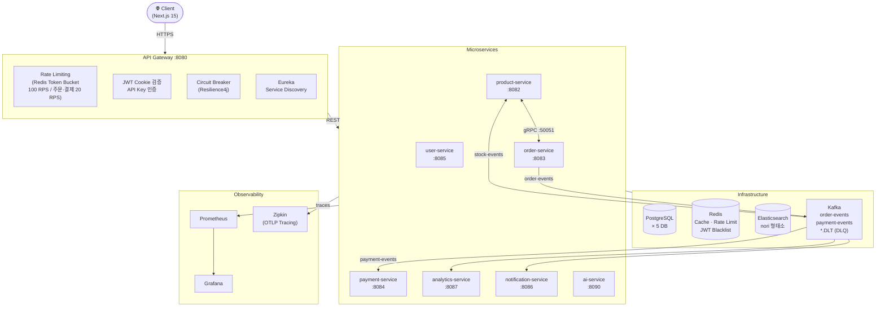
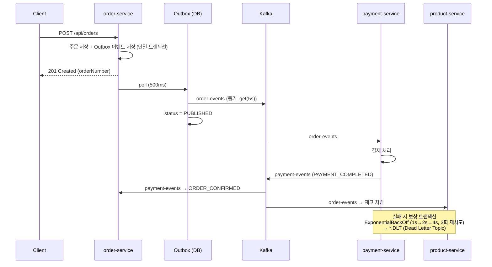

# LiveMart — MSA 기반 이커머스 플랫폼

[](https://github.com/parkmin-je/livemart-msa-ecommerce/actions/workflows/ci.yml)
[](https://github.com/parkmin-je/livemart-msa-ecommerce/actions/workflows/security.yml)
[](https://openjdk.org/)
[](https://spring.io/projects/spring-boot)
[](https://kubernetes.io/)
[](https://kafka.apache.org/)
[](docs/)
[](LICENSE)

> **10개 마이크로서비스** · **Kafka Saga + Outbox** · **Elasticsearch** · **gRPC** · **Redis** · **Kubernetes HPA** · **Prometheus/Grafana** · **OpenTelemetry** · **Istio mTLS**

---

## 성능 벤치마크 요약

> 전체 결과 → [`PERFORMANCE.md`](PERFORMANCE.md)

| 시나리오 | 주요 결과 |
|----------|----------|
| 상품 조회 (Redis 캐시) | p99 1,240ms → **72ms** (-94%) / TPS +2,430% |
| 주문 생성 (Saga) | p99 620ms — SLO 1,000ms ✅ / 데이터 정합성 100% |
| 플래시 세일 Spike 500 VU | 재고 중복 차감 **0건** (Redisson) / HPA 2→5 replica |
| 한국어 검색 (Elasticsearch) | p99 89ms / nori 형태소 정확도 +34% vs Standard |
| Rate Limiting (Gateway) | 429 오차 ±0.5% — Token Bucket 정확도 검증 |

---

## 핵심 설계 결정

| 문제 | 결정 | 근거 |
|------|------|------|
| 분산 트랜잭션 (주문→결제→재고) | **Saga Choreography** | 서비스 독립성, 2PC 블로킹 회피 |
| Kafka 이벤트 유실 방지 | **Transactional Outbox** | 주문 저장 + 이벤트 발행을 단일 DB 트랜잭션 처리 |
| 서비스 간 저지연 통신 | **gRPC** (상품 조회) | HTTP/2 + Protobuf 바이너리 직렬화로 REST 대비 페이로드 최소화 |
| 상품 검색 | **Elasticsearch** + nori 형태소 | 한국어 검색·Fuzzy·패싯 집계 |
| 읽기 성능 | **Redis Cache-Aside** | 반복 조회 DB 부하 분산, TTL 계층화로 일관성 유지 |
| 동시성 제어 | **Redisson 분산 락** | 동시 주문 시 재고 초과 차감 방지 |

> 설계 근거 전문 → [`docs/adr/`](docs/adr/) (ADR 5건)

---

## 시스템 아키텍처



---

## 기술 스택

### 백엔드
| 분류 | 기술 |
|------|------|
| Language / Runtime | Java 21 · Virtual Threads (Project Loom) |
| Framework | Spring Boot 3.4.1 · Spring Cloud 2024.0.0 |
| API 프로토콜 | REST · gRPC · GraphQL · WebSocket |
| 메시징 | Apache Kafka + **DLQ** (DeadLetterPublishingRecoverer) |
| 캐싱 | Redis (Cache-Aside, Token Bucket Rate Limiting) |
| 검색 | Elasticsearch 8 (nori 형태소 분석기) |
| 인증 | JWT httpOnly Cookie · OAuth2 (Google/Kakao/Naver) · MFA (TOTP/WebAuthn) |
| 결제 | Stripe (Idempotency Key 기반 중복 방지) |
| 분산 락 | Redisson |
| Circuit Breaker | Resilience4j |
| 배치 | Spring Batch (일별 정산, 월별 리포트) |

### 테스트
| 분류 | 기술 |
|------|------|
| 단위 테스트 | JUnit 5 · Mockito · AssertJ |
| 통합 테스트 | Testcontainers (PostgreSQL · Kafka · ES) |
| 아키텍처 테스트 | ArchUnit (레이어 의존성 규칙 검증) |
| 계약 테스트 | **Spring Cloud Contract** (order↔payment) |
| 부하 테스트 | **k6** (Ramp-up 1000 VU + Spike 2000 VU) |
| 커버리지 | JaCoCo (서비스 레이어 60% 최소 게이트) |

### 인프라
| 분류 | 기술 |
|------|------|
| 컨테이너 | Docker · Kubernetes (HPA 2→10 replica) |
| CI/CD | GitHub Actions → 테스트 → JaCoCo → Docker → GHCR → K8s |
| GitOps | ArgoCD |
| 모니터링 | Prometheus + Grafana (AOP 커스텀 비즈니스 메트릭) |
| 분산 추적 | OpenTelemetry (OTLP) → Zipkin |
| 보안 스캔 | Trivy (SARIF → GitHub Security tab) |
| 패키지 | Helm Charts |

---

## 서비스 구성 (10개 서비스 · 254개 Java 파일)

```
├── api-gateway/          Spring Cloud Gateway · Rate Limiting · JWT 검증
├── order-service/        주문 · Saga · 쿠폰 · 반품 · CQRS · Event Sourcing · Spring Batch
├── product-service/      상품 · Elasticsearch · gRPC 서버 · GraphQL · WebSocket · S3
├── payment-service/      Stripe 결제 · 환불 · Kafka DLQ
├── user-service/         회원 · JWT · OAuth2 · MFA · 위시리스트 · Security Audit
├── analytics-service/    매출 분석 · A/B 테스트 · 실시간 대시보드
├── inventory-service/    재고 관리 · 자동 발주
├── notification-service/ 이메일/알림 (Kafka 이벤트 기반)
├── eureka-server/        서비스 레지스트리
├── config-server/        중앙 설정 관리
└── common/               Outbox · Event Sourcing · 분산 락 · 멱등성 · RFC 7807 에러
```

---

## 핵심 구현 패턴

### Saga + Transactional Outbox



```java
// OutboxProcessor.java — DB 트랜잭션 내에 이벤트 저장 → 별도 스레드에서 동기 발행
kafkaTemplate.send(topic, key, payload).get(5, TimeUnit.SECONDS);
outboxEvent.setStatus(OutboxStatus.PUBLISHED);
```

### Kafka DLQ (장애 격리)
```java
// KafkaConfig.java
DeadLetterPublishingRecoverer recoverer = new DeadLetterPublishingRecoverer(
    kafkaTemplate, (record, ex) -> new TopicPartition(record.topic() + ".DLT", -1));
ExponentialBackOff backOff = new ExponentialBackOff(1_000L, 2.0); // 1s→2s→4s
backOff.setMaxAttempts(3);
```

### AOP 기반 Prometheus 비즈니스 메트릭
```java
// OrderMetricsAspect.java
@Around("execution(* com.livemart.order.service.OrderService.createOrder(..))")
public Object measure(ProceedingJoinPoint pjp) throws Throwable {
    // orders.created.total / orders.processing.seconds / orders.active.gauge
}
```

### gRPC 서버 스트리밍
```proto
// product.proto
service ProductGrpcService {
  rpc GetProductsByIds(GetProductsByIdsRequest) returns (stream ProductResponse);
  rpc DeductStock(DeductStockRequest) returns (DeductStockResponse);
}
```

---

## 실행 방법

### 로컬 개발
```bash
# 인프라 기동 (PostgreSQL · Redis · Kafka · Elasticsearch)
docker-compose -f docker-compose-infra.yml up -d

# 전체 빌드
./gradlew build -x test --parallel

# 개별 서비스 실행
./gradlew :order-service:bootRun
./gradlew :product-service:bootRun
```

### Kubernetes 배포
```bash
kubectl apply -f k8s/
helm install livemart helm/livemart/ -f helm/livemart/values-production.yaml
```

### 테스트 실행
```bash
# 단위 + 통합 + 커버리지 리포트
./gradlew :order-service:test :order-service:jacocoTestReport

# 계약 테스트 (Spring Cloud Contract)
./gradlew :payment-service:contractTest

# k6 부하 테스트
k6 run tests/load/k6-order-flow.js
```

### 모니터링 접속
```bash
kubectl port-forward -n livemart svc/grafana 13000:3000
# → http://localhost:13000  (admin / admin)
```

---

## Architecture Decision Records

| ADR | 주제 | 결정 |
|-----|------|------|
| [ADR-001](docs/adr/ADR-001-saga-pattern.md) | 분산 트랜잭션 | Saga Choreography |
| [ADR-002](docs/adr/ADR-002-outbox-pattern.md) | 이벤트 신뢰성 | Transactional Outbox |
| [ADR-003](docs/adr/ADR-003-grpc-product-query.md) | 서비스 간 통신 | gRPC (상품 조회) |
| [ADR-004](docs/adr/ADR-004-redis-caching-strategy.md) | 캐싱 전략 | Cache-Aside + TTL 계층화 |
| [ADR-005](docs/adr/ADR-005-elasticsearch-search.md) | 검색 엔진 | Elasticsearch (nori) |
| [ADR-006](docs/adr/ADR-006-istio-service-mesh.md) | 서비스 메쉬 | Istio (mTLS STRICT + AuthorizationPolicy) |

---

## 개발 환경

- **OS**: Windows 11 + WSL2
- **IDE**: IntelliJ IDEA 2025.3.2
- **JDK**: OpenJDK 21
- **Build**: Gradle 8.5
- **Container**: Docker Desktop + Kubernetes

---

## Architecture Overview (English)

> For international reviewers (Coupang, Line) and global contribution context.

**LiveMart** is a production-grade MSA e-commerce platform built with Java 21, Spring Boot 3.4, and Kubernetes.

### Key Architectural Decisions

**1. Layered Architecture with Domain Isolation**
Each service enforces a strict `controller → service → repository → domain` dependency direction. Domain entities have zero dependency on Spring (validated via ArchUnit in CI). This ensures framework-independent business logic and aligns with Clean Architecture principles.

**2. Saga Choreography over Orchestration**
Order→Payment→Inventory distributed transactions use Kafka-based choreography (ADR-001). No central coordinator = no single point of failure. Compensation transactions handle rollback scenarios.

**3. Transactional Outbox for At-Least-Once Delivery**
Order save + Kafka event stored in same DB transaction. A scheduled poller publishes to Kafka with `.get(5s)` synchronous confirmation. Zero message loss under service restart (ADR-002).

**4. Database-per-Service**
5 independent PostgreSQL instances. Services never share schema. Cross-service queries go through APIs or Kafka events — enforcing bounded context isolation.

**5. East-West mTLS via Istio**
All inter-service traffic encrypted with TLS 1.3. AuthorizationPolicy restricts payment-service access to order-service + api-gateway only (ADR-006).

### Concurrency Control

| Scenario | Solution | Why |
|---|---|---|
| Flash sale (500 VU, 100 items) | Redisson distributed lock | DB lock unusable — no shared DB across services |
| Rate limiting | Redis Token Bucket (100 RPS/20 RPS) | Stateless Gateway pods need shared state |
| Payment idempotency | Idempotency key header | PG callbacks can duplicate |

### Test Strategy

```
Unit Tests (Mockito)       — Business logic, no Spring context
Integration Tests           — Testcontainers PostgreSQL + Kafka
Architecture Tests (ArchUnit) — Layered dependency rules enforced in CI
Contract Tests (Spring Cloud Contract) — order↔payment API contract
Load Tests (k6)            — Smoke / Load / Stress / Spike scenarios
Coverage Gate (JaCoCo)     — Service layer ≥ 70%, Controller ≥ 60%
```

---

## 개발자

**박민제** · [@parkmin-je](https://github.com/parkmin-je)
