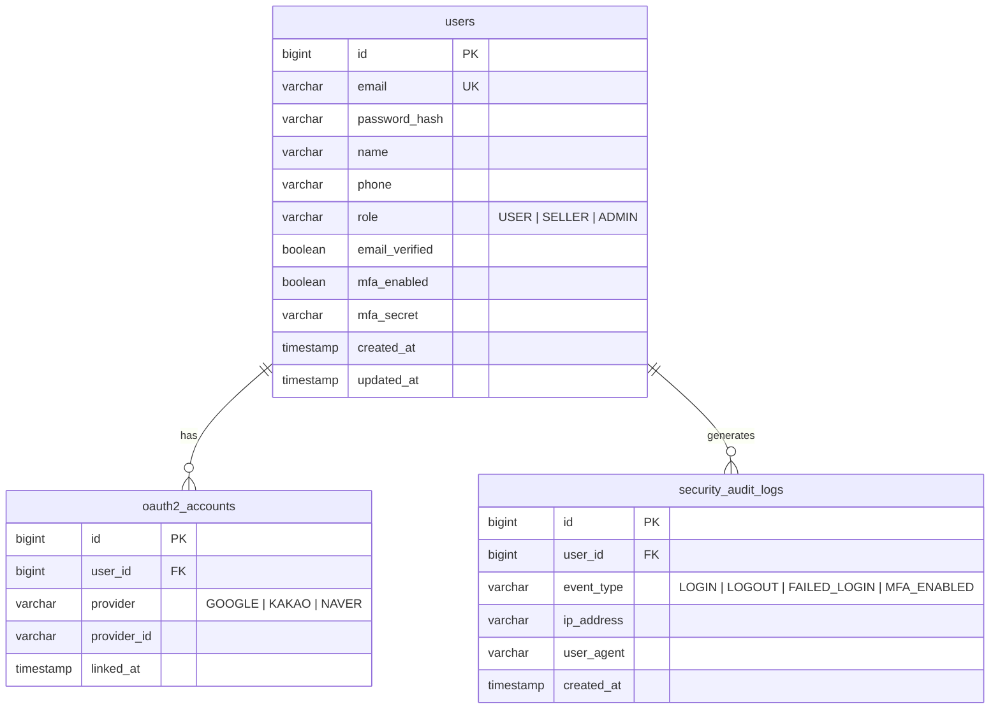
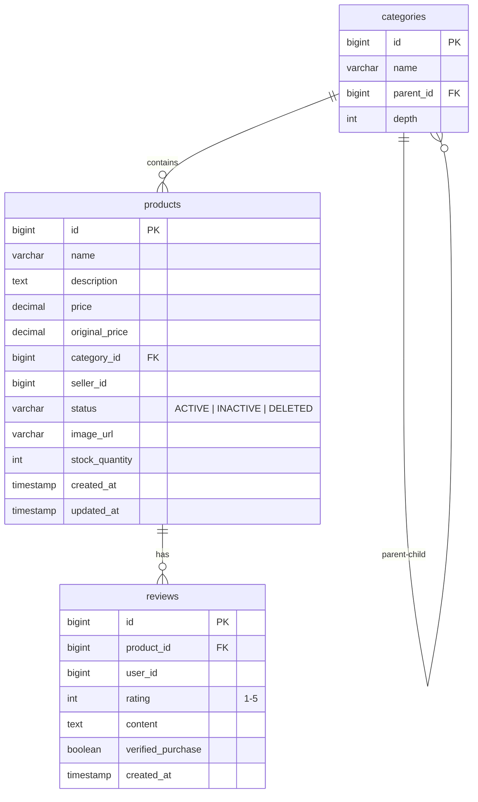
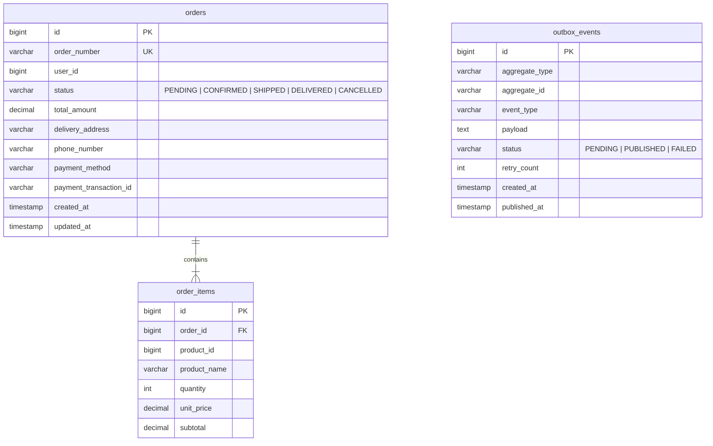
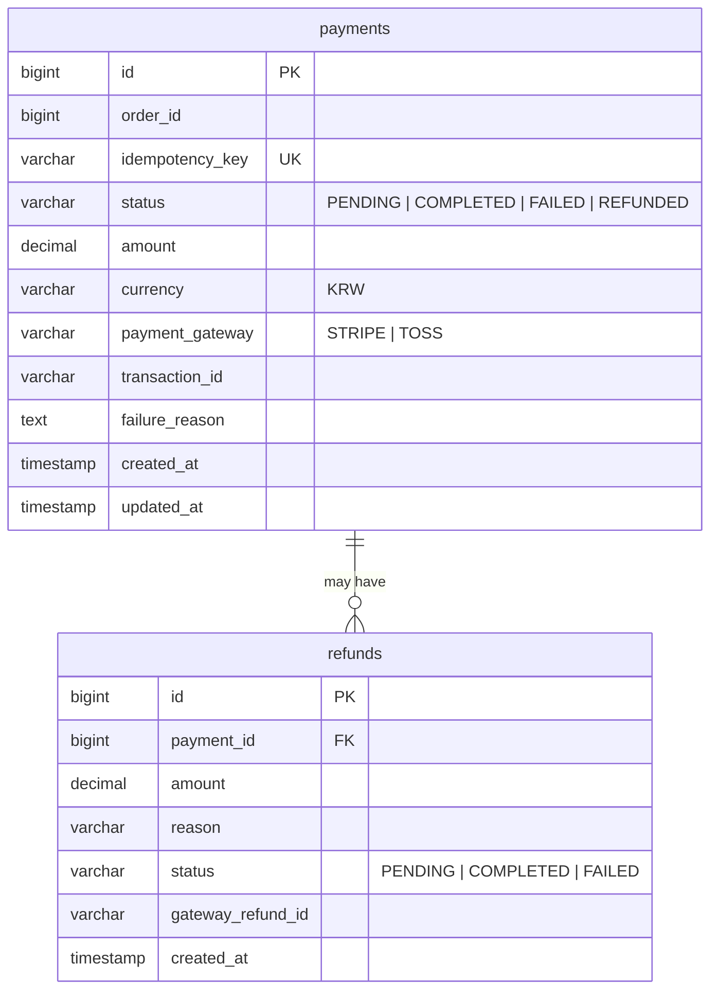
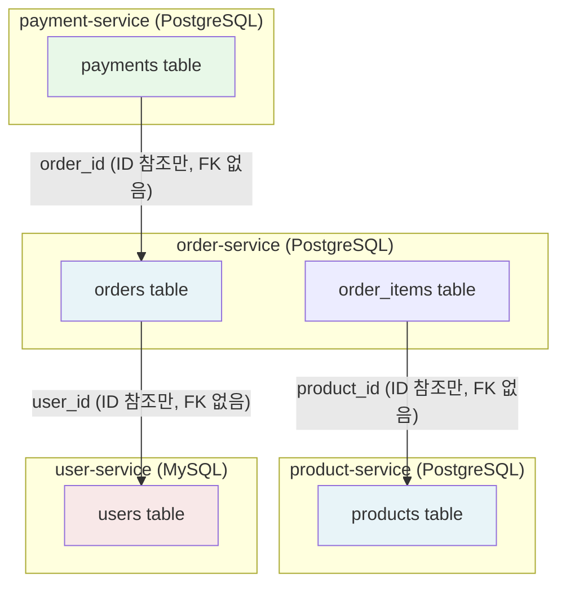

# 데이터베이스 스키마 — LiveMart MSA

각 서비스는 독립된 DB 인스턴스를 사용합니다 (Database per Service 패턴).

## user-service (MySQL 8.0 / userdb)

## product-service (PostgreSQL / productdb)

## order-service (PostgreSQL / orderdb)

## payment-service (PostgreSQL / paymentdb)

## 서비스 간 데이터 참조 방식

> **설계 원칙**: 서비스 간 외래키(FK) 제약 없음. ID만 보관하며 데이터는 API/이벤트로 조회.
> 데이터 일관성은 Saga + Outbox 패턴으로 보장.
