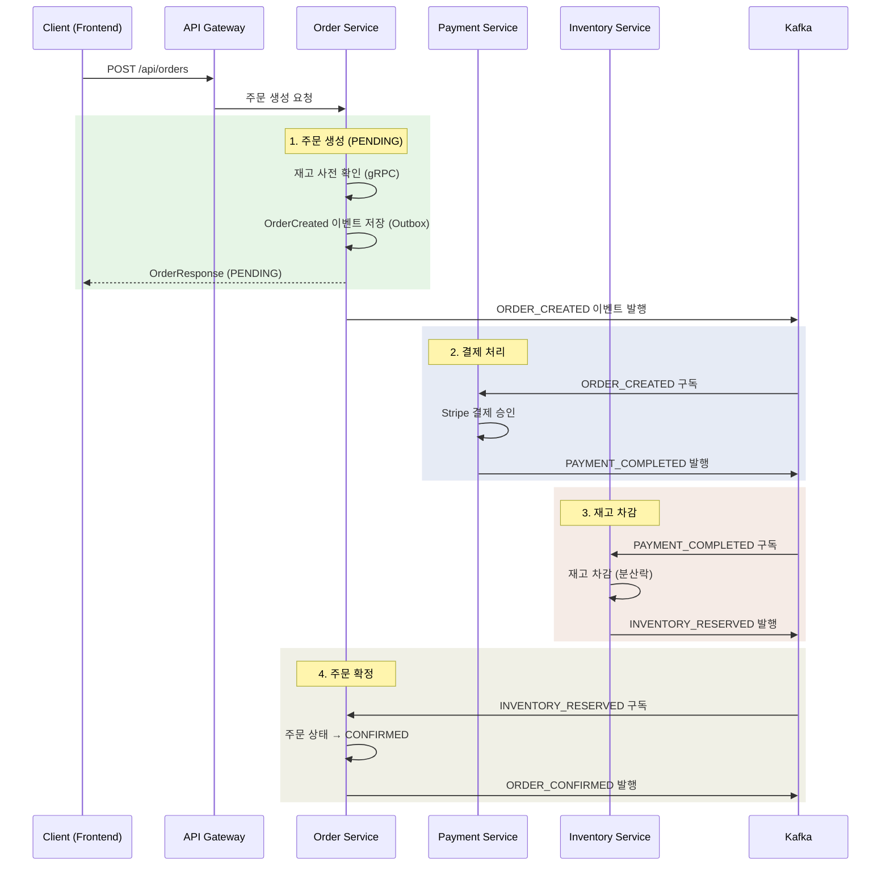
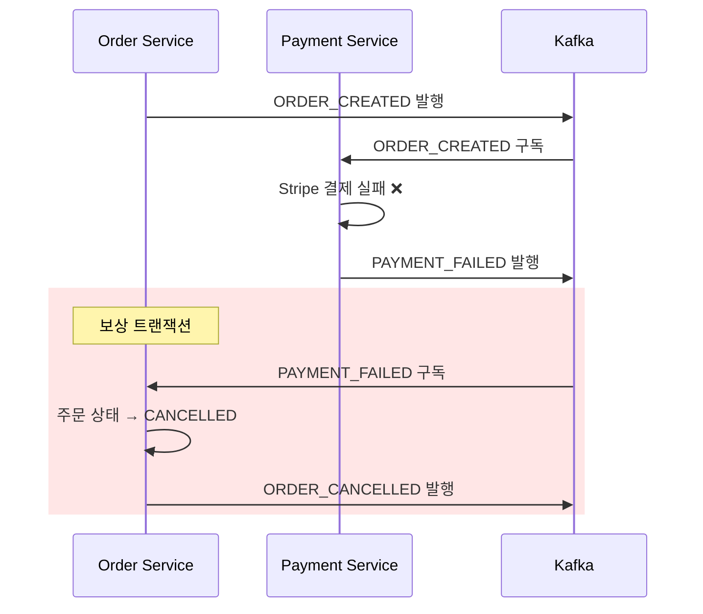
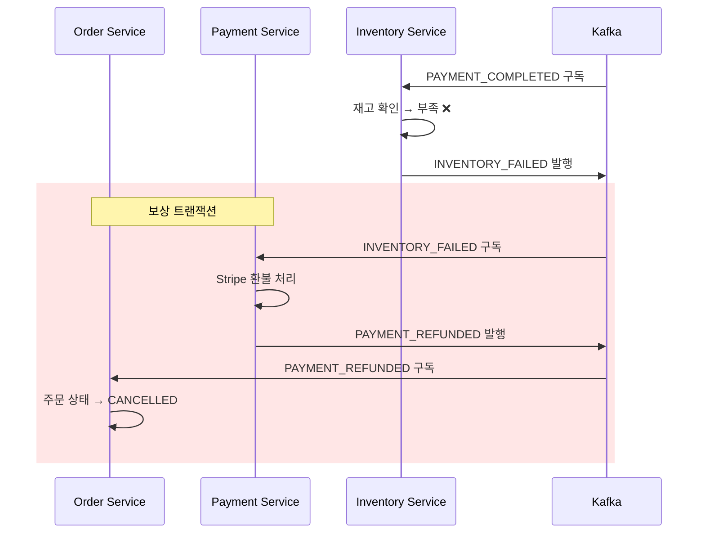
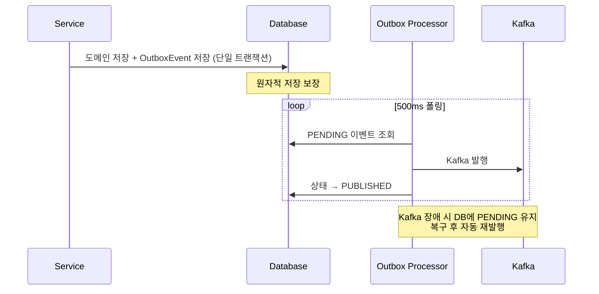
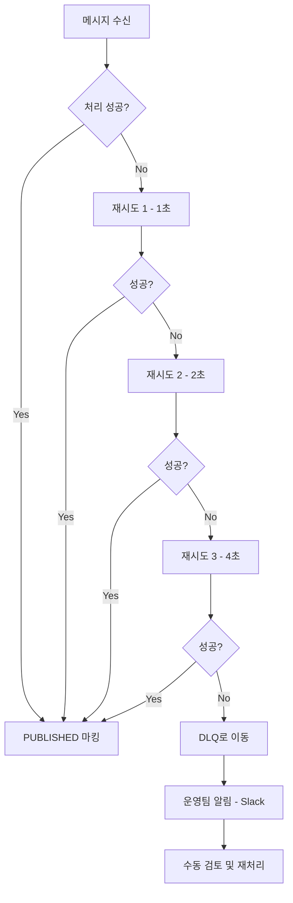

# Saga Choreography Flow — 주문→결제→재고

LiveMart는 분산 트랜잭션을 **Saga Choreography** 패턴으로 처리합니다.
중앙 오케스트레이터 없이 각 서비스가 이벤트를 구독·발행하여 자율 협력합니다.

## 정상 플로우

## 실패 시나리오 — 결제 실패 보상 트랜잭션

## 실패 시나리오 — 재고 부족 보상 트랜잭션

## Transactional Outbox — 메시지 유실 방지

## DLQ 재처리 흐름

